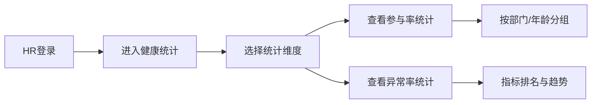

## 1. 产品概述

企业员工年度体检统一预约与健康档案管理系统，旨在解决企业员工体检预约分散、健康数据零散、隐私保护不足等问题。系统支持HR统一配置体检套餐与合作机构，员工在线自助预约，体检机构统一对接上传报告，同时保障员工隐私，HR仅可查看聚合统计数据。

- **目标用户**：企业HR管理人员、企业员工、体检机构对接人员
- **核心价值**：统一预约管理、电子报告在线查看、历年健康数据对比、隐私保护下的健康统计分析

## 2. 核心功能

### 2.1 用户角色

| 角色 | 登录方式 | 核心权限 |
|------|----------|----------|
| HR管理员 | 账号密码登录 | 体检套餐管理、体检机构管理、预约汇总查看、健康统计分析、员工管理 |
| 员工用户 | 账号密码登录 | 体检预约、报告查看、健康档案、历年数据对比 |
| 机构用户 | 账号密码登录 | 预约查看、报告上传、机构信息维护 |

### 2.2 功能模块

1. **登录页**：角色选择登录、账号密码验证
2. **HR管理端**：
   - 仪表盘：体检参与率、异常检出率统计概览
   - 套餐管理：体检套餐增删改查、项目配置
   - 机构管理：合作机构管理、门店配置
   - 预约管理：全部预约列表、状态筛选、批量导出
   - 健康统计：指标异常率统计、参与率分析、部门对比
3. **员工端**：
   - 首页：待预约提醒、最新报告概览
   - 体检预约：套餐选择、门店选择、日期选择、预约确认
   - 我的预约：预约列表、取消预约
   - 体检报告：报告列表、报告详情、异常高亮、参考范围
   - 健康档案：历年数据汇总、单指标多年对比图表
4. **机构端**：
   - 预约管理：查看本机构预约列表
   - 报告上传：按预约上传电子报告、指标录入

### 2.3 页面详情

| 页面名称 | 模块名称 | 功能描述 |
|----------|----------|----------|
| 登录页 | 登录表单 | 角色切换、账号输入、密码输入、登录按钮 |
| HR仪表盘 | 统计卡片 | 参与率、异常率、体检人数、异常项Top5 |
| HR仪表盘 | 趋势图表 | 月度预约趋势、各部门参与率柱状图 |
| 套餐管理 | 套餐列表 | 套餐卡片展示、搜索筛选、新增/编辑/删除 |
| 套餐管理 | 套餐表单 | 套餐名称、价格、包含项目、适用人群 |
| 机构管理 | 机构列表 | 机构卡片、门店数量、联系信息 |
| 机构管理 | 门店配置 | 门店地址、联系方式、可约时段 |
| 预约管理 | 预约列表 | 全部预约、状态筛选、按机构/日期筛选 |
| 健康统计 | 异常率统计 | 各指标异常率排名、部门对比 |
| 健康统计 | 参与率分析 | 整体参与率、部门参与率、年龄分布 |
| 员工首页 | 待办提醒 | 待预约、待体检、报告已出 |
| 员工首页 | 健康概览 | 最近一次体检关键指标 |
| 体检预约 | 套餐选择 | 套餐列表、套餐详情展示 |
| 体检预约 | 门店选择 | 地图/列表展示、按距离排序 |
| 体检预约 | 时间选择 | 日期选择、时段选择 |
| 我的预约 | 预约列表 | 全部预约、状态标签、取消操作 |
| 体检报告 | 报告列表 | 历年报告、年份筛选 |
| 体检报告 | 报告详情 | 指标列表、异常高亮、参考范围显示 |
| 健康档案 | 数据总览 | 历年所有指标汇总表 |
| 健康档案 | 趋势对比 | 单指标多年折线图、趋势分析 |
| 机构端首页 | 预约概览 | 今日预约、待上传报告 |
| 机构端报告上传 | 报告表单 | 选择预约、录入指标、上传PDF |

## 3. 核心流程

### 3.1 员工体检预约流程

员工登录系统后，浏览可用体检套餐，选择就近门店和合适日期时段，确认预约。系统生成预约记录，同步至对应体检机构。

### 3.2 体检报告上传与查看流程

体检完成后，机构登录系统上传电子报告及各项指标数据。员工可在系统内查看报告详情，异常指标高亮显示并附参考范围。

### 3.3 HR健康统计流程

HR可查看全公司体检参与率、各指标异常检出率等聚合统计数据，无法查看员工个人详细报告，保护员工隐私。

## 4. 用户界面设计

### 4.1 设计风格

- **主色调**：医疗蓝（#165DFF）作为主色，代表专业与信任
- **辅助色**：健康绿（#00B42A）表示正常，警示橙（#FF7D00）表示需关注，危险红（#F53F3F）表示异常
- **中性色**：深灰#1D2129、中灰#4E5969、浅灰#C9CDD4、背景#F2F3F5
- **按钮风格**：圆角8px，主按钮实色填充，次按钮描边样式
- **字体**：使用思源黑体/苹方等现代无衬线字体，标题字重600，正文400
- **布局风格**：左右分栏布局，左侧导航，右侧内容区，卡片式内容展示
- **图标风格**：线性图标，2px描边，与主色一致

### 4.2 页面设计概览

| 页面名称 | 模块名称 | UI元素 |
|----------|----------|--------|
| 登录页 | 登录卡片 | 渐变背景、居中卡片、角色切换标签、输入框带图标 |
| HR仪表盘 | 统计概览 | 彩色数字卡片、图标装饰、悬停微动效 |
| HR仪表盘 | 图表区域 | 折线图+柱状图组合、卡片阴影、渐变填充 |
| 套餐管理 | 套餐卡片 | 卡片网格布局、标题+描述+价格、操作按钮悬浮 |
| 报告详情 | 指标列表 | 表格布局、异常行红色背景、参考范围灰色小字 |
| 健康档案 | 对比图表 | 多色折线图、年份图例、数据点提示 |

### 4.3 响应式

- 桌面端优先设计，适配1920px、1440px、1280px常见分辨率
- 平板端：左侧导航可收起，内容区自适应
- 移动端：底部导航栏，卡片单列布局，表格横向滚动
- 触控优化：按钮最小44px点击区域，列表项适当增加间距

### 4.4 交互与动效

- 页面加载：骨架屏占位，内容渐入显示
- 卡片悬停：轻微上浮+阴影加深
- 数据更新：数字滚动动画
- 导航切换：平滑过渡效果
- 表单提交：加载状态按钮
