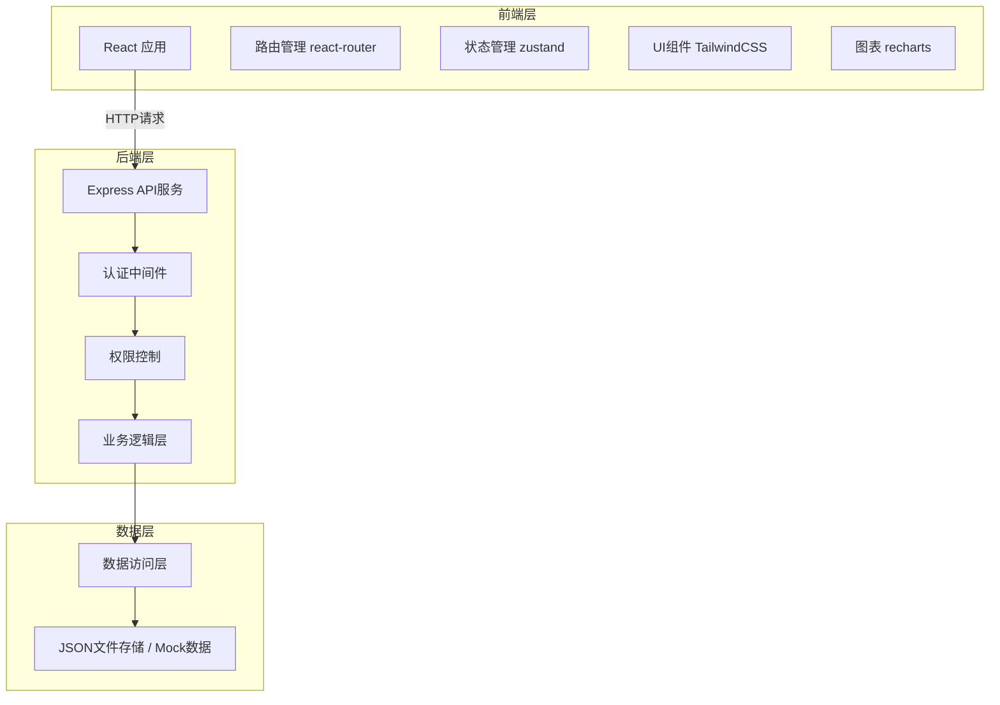
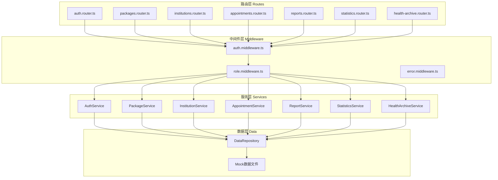
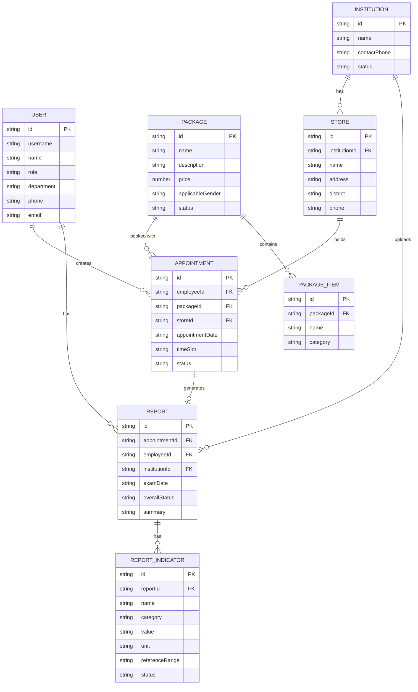

## 1. 架构设计



## 2. 技术描述

- **前端**：React@18 + TypeScript + Vite + TailwindCSS@3 + React Router@6 + Zustand + Recharts + Lucide React
- **后端**：Express@4 + TypeScript
- **数据存储**：使用 JSON 文件模拟数据库，包含完整的 Mock 数据
- **认证方式**：基于 Token 的简单认证（Mock实现）
- **初始化工具**：vite-init

## 3. 路由定义

### 前端路由

| 路由路径 | 页面名称 | 角色权限 |
|----------|----------|----------|
| /login | 登录页 | 公开 |
| /hr/dashboard | HR仪表盘 | HR |
| /hr/packages | 套餐管理 | HR |
| /hr/institutions | 机构管理 | HR |
| /hr/appointments | 预约管理 | HR |
| /hr/statistics | 健康统计 | HR |
| /employee/home | 员工首页 | 员工 |
| /employee/appointment | 体检预约 | 员工 |
| /employee/my-appointments | 我的预约 | 员工 |
| /employee/reports | 体检报告 | 员工 |
| /employee/health-archive | 健康档案 | 员工 |
| /institution/home | 机构首页 | 机构 |
| /institution/appointments | 预约管理 | 机构 |
| /institution/report-upload | 报告上传 | 机构 |

### 后端 API 路由

| 方法 | 路径 | 功能描述 |
|------|------|----------|
| POST | /api/auth/login | 用户登录 |
| GET | /api/auth/profile | 获取当前用户信息 |
| GET | /api/packages | 获取体检套餐列表 |
| GET | /api/packages/:id | 获取套餐详情 |
| POST | /api/packages | 新增套餐（HR） |
| PUT | /api/packages/:id | 编辑套餐（HR） |
| DELETE | /api/packages/:id | 删除套餐（HR） |
| GET | /api/institutions | 获取机构列表 |
| GET | /api/institutions/:id/stores | 获取机构门店 |
| POST | /api/institutions | 新增机构（HR） |
| PUT | /api/institutions/:id | 编辑机构（HR） |
| DELETE | /api/institutions/:id | 删除机构（HR） |
| GET | /api/appointments | 获取预约列表 |
| POST | /api/appointments | 创建预约（员工） |
| PUT | /api/appointments/:id/cancel | 取消预约 |
| GET | /api/reports | 获取报告列表 |
| GET | /api/reports/:id | 获取报告详情 |
| POST | /api/reports | 上传报告（机构） |
| GET | /api/statistics/participation | 参与率统计（HR） |
| GET | /api/statistics/abnormalities | 异常率统计（HR） |
| GET | /api/health-archive | 健康档案（员工） |
| GET | /api/health-archive/trend | 指标趋势数据（员工） |

## 4. API 类型定义

```typescript
// 用户类型
interface User {
  id: string;
  username: string;
  name: string;
  role: 'hr' | 'employee' | 'institution';
  department?: string;
  phone?: string;
  email?: string;
  avatar?: string;
  institutionId?: string;
}

// 体检套餐
interface Package {
  id: string;
  name: string;
  description: string;
  price: number;
  originalPrice?: number;
  items: PackageItem[];
  applicableGender: 'all' | 'male' | 'female';
  minAge?: number;
  maxAge?: number;
  imageUrl?: string;
  status: 'active' | 'inactive';
  createdAt: string;
}

interface PackageItem {
  id: string;
  name: string;
  category: string;
  description?: string;
}

// 体检机构
interface Institution {
  id: string;
  name: string;
  logoUrl?: string;
  description: string;
  contactPhone: string;
  contactEmail?: string;
  stores: Store[];
  status: 'active' | 'inactive';
  createdAt: string;
}

interface Store {
  id: string;
  name: string;
  address: string;
  district: string;
  phone: string;
  businessHours: string;
  latitude?: number;
  longitude?: number;
  timeSlots: TimeSlot[];
}

interface TimeSlot {
  date: string;
  slots: string[];
  available: number;
}

// 预约记录
interface Appointment {
  id: string;
  employeeId: string;
  employeeName: string;
  employeeDepartment: string;
  packageId: string;
  packageName: string;
  institutionId: string;
  institutionName: string;
  storeId: string;
  storeName: string;
  storeAddress: string;
  appointmentDate: string;
  timeSlot: string;
  status: 'pending' | 'confirmed' | 'completed' | 'cancelled';
  createdAt: string;
  reportId?: string;
}

// 体检报告
interface Report {
  id: string;
  appointmentId: string;
  employeeId: string;
  employeeName: string;
  packageId: string;
  packageName: string;
  institutionId: string;
  institutionName: string;
  examDate: string;
  uploadDate: string;
  summary: string;
  overallStatus: 'normal' | 'attention' | 'abnormal';
  indicators: ReportIndicator[];
  pdfUrl?: string;
}

interface ReportIndicator {
  id: string;
  name: string;
  category: string;
  value: string;
  unit: string;
  referenceRange: string;
  status: 'normal' | 'low' | 'high' | 'abnormal';
  description?: string;
}

// 统计数据
interface ParticipationStats {
  totalEmployees: number;
  participatedCount: number;
  participationRate: number;
  byDepartment: { department: string; total: number; participated: number; rate: number }[];
  byAgeGroup: { ageGroup: string; total: number; participated: number; rate: number }[];
  monthlyTrend: { month: string; count: number }[];
}

interface AbnormalityStats {
  totalExamined: number;
  indicators: { name: string; abnormalCount: number; rate: number; rank: number }[];
  byDepartment: { department: string; indicator: string; rate: number }[];
  yearOverYear: { year: string; indicator: string; rate: number }[];
}

// 健康档案
interface HealthArchive {
  employeeId: string;
  employeeName: string;
  years: number[];
  yearlyReports: { year: number; reportId: string; examDate: string; indicators: ReportIndicator[] }[];
}
```

## 5. 后端架构图



## 6. 数据模型

### 6.1 ER图



### 6.2 数据文件结构

使用 JSON 文件存储模拟数据，位于 `api/data/` 目录下：

- `users.json` - 用户数据
- `packages.json` - 体检套餐数据
- `institutions.json` - 体检机构与门店数据
- `appointments.json` - 预约记录数据
- `reports.json` - 体检报告数据
- `indicators.json` - 指标参考数据
